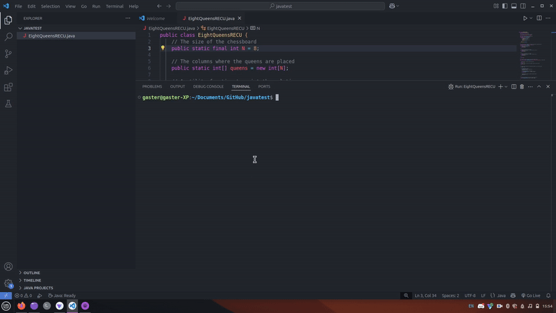

# Eight Queens Recursive Solver

A fully recursive implementation to solve the classic Eight Queens Puzzle in Java.

[](https://opensource.org/licenses/MIT)

## Overview

This project implements a recursive backtracking algorithm to solve the famous Eight Queens Puzzle. The challenge is to place eight chess queens on an 8×8 chessboard so that no two queens threaten each other; thus, a solution requires that no two queens share the same row, column, or diagonal.




## Features

- Pure recursive implementation without loops (created as a programming challenge)
- Visualization of the solution on the console using a text-based chessboard
- Option to find all possible solutions by uncommenting a section of the code
- Clear documentation and explanations in comments

## Example Output

When you run the program, it will display a solution like this:

```
Q  .  .  .  .  .  .  .  
.  .  .  .  Q  .  .  .  
.  .  .  .  .  .  .  Q  
.  .  .  .  .  Q  .  .  
.  .  Q  .  .  .  .  .  
.  .  .  .  .  .  Q  .  
.  Q  .  .  .  .  .  .  
.  .  .  Q  .  .  .  .  
```

## How to Use

1. Clone this repository
2. Compile the Java file: `javac EightQueensRECU.java`
3. Run the program: `java EightQueensRECU`

By default, the program will find and display one solution. If you want to find more solutions, uncomment the indicated section in the `main` method.

## How It Works

1. Initialize the chessboard
2. Use recursive backtracking to place queens one by one
3. Check if a queen can be placed safely in each position
4. If a solution is found, print the chessboard

## Note

This implementation prioritizes recursive elegance over performance. It was created as a programming challenge to solve the Eight Queens Puzzle using maximum recursion.

## License

This project is licensed under the MIT License - see the LICENSE file for details.

## Contributing

If you found a problem in the code, please create an issue on GitHub. Contributions are welcome!

## Keywords

Eight Queens Puzzle, Recursive Algorithm, Backtracking, Java, Chess Programming, Algorithm Visualization
